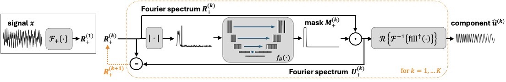

# Iterative Deep-learning-based Signal Decomposition (IDSD)
This repository contains the code belonging to the paper "IDSD: Iterative Deep-learning-based Signal Decomposition".

IDSD is a neural network (with a u-net architecture) that takes as input the (positive axis of a) Fourier spectrum and predicts a soft mask (or a filter) that will be applied element-wise on the spectrum to extract one component.
By iteratively applying this process, multiple components are extracted. 




During training only the main component is extracted (i.e. the one with the highest peak in frequency domain). 
During deployment IDSD runs itereratively to extract K components. The remainder of the spectrum after extracting K components is the residual/noise component.


## Dependencies:

The experiments were all run on the mps of a Mac Book Pro M4, with python 3.12.2 and torch 2.5.1.

To recreate this environment:

Download the [anaconda package](https://www.anaconda.com/).

In the terminal (Linux/OSX) or in the anaconda prompt (Windows) run:

```conda create -n IDSD_env python==3.12.2```

Activate the environment with: ```conda activate IDSD_env``` and run:

##### Run this in OSX
```pip install torch==2.5.1 -f https://download.pytorch.org/whl/torch_stable.html ```

##### Run this on Windows or Linux
```conda install pytorch==2.5.1 pytorch-cuda=11.8 -c pytorch -c nvidia```

##### Then install the requirements:
```pip install -r requirements.txt```


## Training the IDSD model on our synthetic data generator
The model (implementation can be found in experiments/model.py) is trained on synthetic data that is generated on the fly in the dataloader. 
You can train the model using experiments/IDSD_training.py
The trained model will be stored in experimments/trained_models/IDSD.

The training script automatically runs inference as well on the synthetic test data sets that were used in the paper.
To this end, the script will try to read the data from the data/ subfolder. Since the data files together are too large for this Github repository, you can download them from [here](https://doi.org/10.17026/PT/1QTZ39).
After downloading the datasets, place them (without changing their names) in the data/ subfolder.
To create your own new test dataset, you can use the data/generate_test_data.py file, but if you want to make sure that you use exactly the same test data, you should download the test datasets that we already generated.

Additionallly, the script runs inference no the tsunami data. It first finetunes the model on measurement in the month before the tsunami hit, after which inference is run on the data from 10-14 March 2011, when the tsunami hit. 

## Note on the use of IDSD in further studies
The promise of a deep-learning-based model like IDSD is that it can be trained on any type of data distribution. As long as you have data available with the ground-truth component(s), you can train the model on that data.
In this way IDSD operates a bit differently than classical algorithms like VMD and SSD, which you can directly deploy on your new signal. If you want to deploy IDSD on your signal, make sure to train it first on a training set that resembles the properties of your signal. 
This could be synthetic dataset with ground-truth components available, as long as the properties of the components match the type of components you want to extract from your signal (in terms of properties in the frequency domain).

As an example of this process we included the tsunami data in the paper.
We used the model that was trained on the synthetic data generator. It could directly decompose the tsunami data, but performance for decomposition of the tsunami data was better when the model was trained further on data that was more closely resembling the tsunami test data.
Therefore we took tidal measurements from the month before the tsunami hit and finetuned the model further on it. This showcases the promise of deep-learning-based signal decomposition where the model can be taught to decompose any type of component, as long as it was seen in the training process.

## Running the baselines

##### EMD, SSD, SVMD and VMD
These baselines can be run on the synthetic test data sets using the scripts: baselines/run_EMD_SSD_on_synthetic_test_set.m and baselines/run_VMD_SVMD_on_synthetic_test_set.m. The generate the results in the paper, we run these scripts in Matlab2024b.
Results are automatically saved to the baselines folder with a subfolder that is automatically created with the name of the algorithm, e.g.: in baselines/ssd/ the output of SSD will be stored.
The baselines/SVMD folder contains the code belonging to the SVMD paper (retrieved from: [Mathworks file SVMD](https://nl.mathworks.com/matlabcentral/fileexchange/98649-successive-variational-mode-decomposition-svmd-m)), and baselines/matlab_code-SSD contains the code from the SSD paper (retrieved from: [Code SSD](https://project.dke.maastrichtuniversity.nl/ssd/downloads/)).
The implementations of EMD and VMD are built-in in Matlab. 

##### SRMD
SRMD can be run using baselines/SRMDmain/run_SRMD_on_synthetic_test_set.py
The requirements for running SRMD are already embedded in the requirements file of this repository, so you can use the same anaconda environment for it. 
The rest of the code in the SRMDmain folder belongs to the original SRMD paper.

##### IRCNN+
To reproduce the results for IRCNN+, run baselines/IRCNNplus_pytorch_implementation/train_torch_model.py
The immplementation of IRCNN+ is our own conversion from the author's Keras implementation to Pytorch code that can run in the same environment as the rest of this repository. 
The original code provided by the authors can be found at: [Github repo IRCNN+](https://github.com/zhoudafa08/RRCNN_plus)
In there you can indicate the data generator type (data_gen_type), being 'IRCNN_datagen' (the author's generator that generates their Dataset_2) or 'SignalDecompositionGenerator' (our data generator).
The requirements for running SRMD are already embedded in the requirements file of this repository, so you can use the same anaconda environment for it. 

